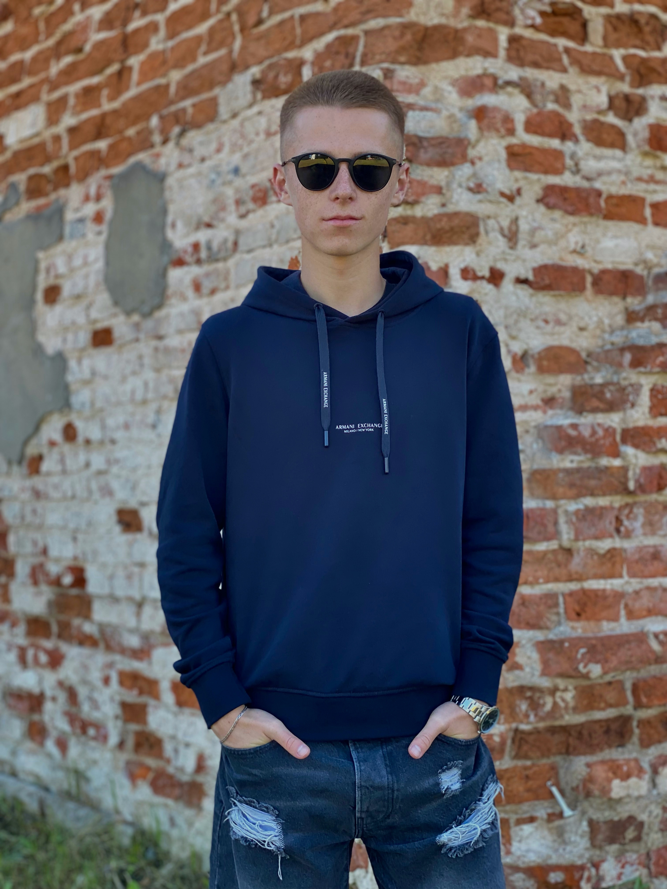

# Gleb Groskreits

### Education: 
+ Gymnasium №1 of the city of Mogilev
+ Belarussian-Russian University
   
### Courses: 
+ lectures on databases; 
+ lectures on C#

### English level: 
A2-B1

### Skills:
+  C#
+  C++
+  HTML

### Info:
My main goal in the field of programming is to constantly expand my knowledge and skills, keeping pace with the latest advancements and technologies. I strive to be a lifelong learner, exploring new programming languages, frameworks, and tools to stay at the forefront of the industry.

### Projects:
 This CV development project is my first project in the field of programming

### Example of code: 
```c#
static void SearchMedicinesChoise(Medicine[] medicines, string filePathToWhrite)
        {
            int n = PrintSearchMenu();
            switch (n)
            {
                case 1:
                    SearchByName(medicines, filePathToWhrite);
                    break;
                case 2:
                    SearchByPrescription(medicines, filePathToWhrite);
                    break;
                default:
                    Console.WriteLine("Неверный выбор.");
                    return;
            }
        }
```
 
### Contacts: 
+ Phone: +375445998100
+ Email: 0Gleb.Groskreits0@gmail.com
+ Instagram: 
[gleb_groskreits](https://www.instagram.com/gleb_groskreits?igsh=Y3B5bXo4d2g3MWh6)
  
